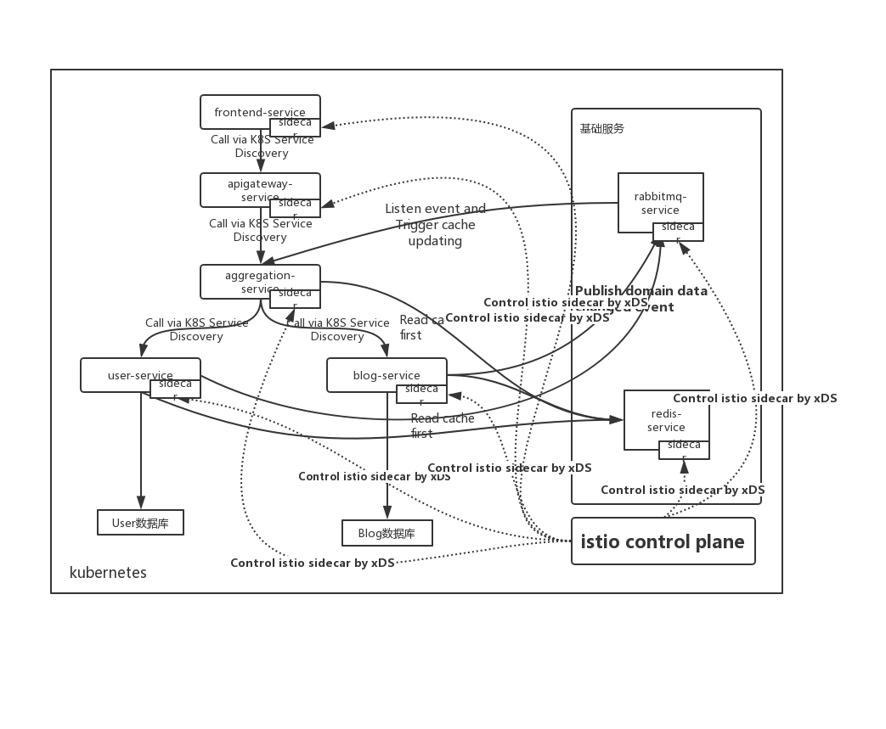

# 原来架构的问题

demo4已经是一个经过架构优化的微服务架构应用，但因为始终还是手工部署在虚拟机里的，在实际运营过程中，我们发现以下几类问题：

* 部署过程稍显复杂
* 依赖于运维工程师手工部署还是比较容易出错
* 部署步骤保存在运维工程师的大脑里，不方便进行修订版本管理
* 不能方便地对应用进行水平扩展，以应对突发的请求压力

而将应用封装成云原生应用可以有效解决上述问题。

# 应用云原生化

`demo6`在`demo5`的基础上，将应用各模块打包成容器镜像，并以标准的[Chart](https://helm.sh/docs/developing_charts/)包形式描述整个应用部署信息，便于部署到kubernetes里去，以实现真正的应用云原生化，最终达成的架构如下：



# 应用云原生化改造

要将原来微服务架构应用云原生化，只需要进行以下改造就可以了。

1. 生成docker镜像

    第一步是将应用各微服务模块打包成docker镜像，对于Spring Cloud应用来说比较方便，修改每个微服务模块的`pom.xml`文件即可。

    `user-service/pom.xml`

    ```xml
    <build>
            <plugins>
                <plugin>
                    <groupId>com.spotify</groupId>
                    <artifactId>docker-maven-plugin</artifactId>
                    <configuration>
                        <imageName>${docker.image.prefix}/${project.artifactId}/${project.artifactId}</imageName>
                        <baseImage>${docker.base.image}</baseImage>
                        <entryPoint>["java", "-Djava.security.egd=file:/dev/./urandom", "-jar", "/${project.build.finalName}.jar", "--spring.config.location=file:/etc/${project.artifactId}/application.properties"]</entryPoint>
                        <resources>
                            <!-- copy the service's jar file from target into the root directory of the image -->
                            <resource>
                                <targetPath>/</targetPath>
                                <directory>${project.build.directory}</directory>
                                <include>${project.build.finalName}.jar</include>
                            </resource>
                            <!-- copy the service's default config file from resources into the /etc/${project.artifactId} directory of the image -->
                            <resource>
                                <targetPath>/etc/${project.artifactId}</targetPath>
                                <directory>${project.basedir}/src/main/resources</directory>
                                <include>${app.config.file.name}</include>
                            </resource>
                        </resources>
                        <!-- optionally overwrite tags every time image is built with docker:build -->
                        <forceTags>true</forceTags>
                        <imageTags>
                            <imageTag>${project.version}</imageTag>
                        </imageTags>
                        <serverId>docker-registry-server</serverId>
                        <registryUrl>https://${docker.registry.server}/</registryUrl>
                    </configuration>
                    <executions>
                        <execution>
                            <id>build-image</id>
                            <phase>package</phase>
                            <goals>
                                <goal>build</goal>
                            </goals>
                        </execution>
                        <execution>
                            <id>tag-image</id>
                            <phase>package</phase>
                            <goals>
                                <goal>tag</goal>
                            </goals>
                            <configuration>
                                <image>${docker.image.prefix}/${project.artifactId}/${project.artifactId}:${project.version}</image>
                                <newName>${docker.registry.server}/${project.artifactId}/${docker.image.prefix}/${project.artifactId}:${project.version}</newName>
                            </configuration>
                        </execution>
                        <execution>
                            <id>push-image</id>
                            <phase>deploy</phase>
                            <goals>
                                <goal>push</goal>
                            </goals>
                            <configuration>
                                <imageName>${docker.registry.server}/${project.artifactId}/${docker.image.prefix}/${project.artifactId}:${project.version}</imageName>
                            </configuration>
                        </execution>
                    </executions>
                </plugin>
                <plugin>
                    <groupId>org.apache.maven.plugins</groupId>
                    <artifactId>maven-deploy-plugin</artifactId>
                    <configuration>
                        <skip>true</skip>
                    </configuration>
                </plugin>
            </plugins>
        </build>
    ```

    上述配置后，以后执行`mvn package -DskipTests=true`会自动生成docker镜像，执行`mvn deploy -DskipTests=true`会自动将docker镜像推送到docker registry。

    注意事项：

    * 请注意在`pom.xml`文件中配置正确的`docker.registry.server`

      `pom.xml`

      ```xml
      ...
      <properties>
              ...
              <docker.registry.server>registry.tcnp.com</docker.registry.server>
              ...
      </properties>
      ...
      ```

    * 在本机的`.m2/settings.xml`文件中注意添加`docker-registry-server`这个server的定义

      `~/.m2/settings.xml`

      ```xml
      <servers>
        ...
        <server>
          <id>docker-registry-server</id>
          <username>xxxx</username>
          <password>xxxx</password>
          <configuration>
            <email>admin@test.com</email>
          </configuration>
        </server>
      </servers>
      ```

2. 编写Chart

   要将应用部署到kubernetes容器平台，可以将应用封装成[chart](https://helm.sh/docs/developing_charts/#charts)（kubernetes平台现在的事实应用打包标准）。

   这里以demo6为例，`chart/demo6`即为demo6应用的chart。

   在这个chart的`charts`可以看到多个目录，这些是顶层chart的subchart，其中`user-service`、`blog-service`、`aggregation-service`、`apigateway-service`、`frontend-service`这5个subchart刚好对应5个微服务模块。`mysql`、`redis`、`rabbitmq`这3个subchart完全从官方的chart仓库里获得。

   ```
   ➜  demo6 (master) ✗ tree -L 2 .
   .
   ├── charts
   │   ├── aggregation-service
   │   ├── apigateway-service
   │   ├── blog-service
   │   ├── frontend-service
   │   ├── mysql
   │   ├── rabbitmq
   │   ├── redis
   │   └── user-service
   ├── Chart.yaml
   ├── templates
   └── values.yaml # 顶层chart的`values.yaml`文件中可以覆写每个subchart的values
   ```

   

   每个微服务模块的chart编写起来也很简单，就是用模板生成kubernetes的`configmap`、`deployment`、`secret`、`service`、`ingress`等资源。

   ```
   ➜  demo6 (master) ✗ tree charts/user-service 
   charts/user-service
   ├── Chart.yaml
   ├── templates
   │   ├── configmap.yaml # configmap资源的模板
   │   ├── deployment.yaml # deployment资源的模板
   │   ├── _helpers.tpl
   │   ├── image-pull-secret.yaml # secret资源的模板
   │   ├── ingress.yaml # ingress资源的模板
   │   └── service.yaml # service资源的模板
   └── values.yaml # 该subchart自身的values
   ```

   顶层chart将这些subchart组织了起来，而且在顶层chart的`values.yaml`文件中可以覆写每个subchart的values。

   将应用封装成Chart后，所有与应用相关的环境依赖、部署操作等都沉淀到chart的源码中了，以后要修改部署操作直接修改chart的定义即可。

# 部署指引

1. 部署到kubernetes

   有了镜像及chart后，就可以将应用直接部署到kubernetes里了，参考命令如下：

   ```bash
   # 创建应用部署的命名空间
   kubectl create namespace demo6
   # 使用helm部署应用
   helm install --namespace demo6 --name demo6 ./chart/demo6
   ```

   部署起来方便了很多，等一会儿，即可在浏览器中访问`http://demo6.arch-revolution.tcnp.com`。

2. istio纳管

   如果想应用被istio纳管，执行以下几步就可以了。

   给应用的命名空间打上istio-injection的标签，参考命令如下：

   ```bash
   kubectl label namespace demo6 istio-injection=enabled
   ```

   导入istio的流量路由规则，参考命令如下：

   ```bash
   kubectl --namespace demo6 apply -f manifests/demo6-istio-route-rules.yaml
   ```

   istio纳管后，在浏览器中访问`http://demo6-istio.arch-revolution.tcnp.com`

# 云原生应用的优势

1. 部署、升级方便

   从上面的部署过程中就可以看出部署过程被极大地简化。而以后升级应用也只需要用`helm upgrade`命令就可以搞定了。

2. 运维操作便于管理

   将应用封装成Chart后，所有与应用相关的环境依赖、部署操作等都沉淀到chart的源码中了，这个相比以前的记在运维工程师的脑袋里，更便于版本管理与维护。

3. 应用水平扩展

   当某个微服务模块的压力过大，需要水平扩展时，只需要新建一个`custom_values.yaml`文件，内容如下：

   `custom_values.yaml`

   ```yaml
   user-service:
     replicaCount: 1
   
   blog-service:
     replicaCount: 1
   
   aggregation-service:
     replicaCount: 1
   
   apigateway-service:
     replicaCount: 1
   
   frontend-service:
     replicaCount: 1
   ```

   按实际情况，将某个`replicaCount`值改大，然后使用`helm upgrade`命令升级原来部署的chart就可以了，参考命令如下：

   ```bash
   helm upgrade demo6 ./chart/demo6 -f custom_values.yaml
   ```

   kubernetes会负责将该微服务模块的pod复制多份运行，并且多个pod会负载均衡对外提供服务。

4. 更方便地复用组件

   在本例中我们使用了官方给出的`mysql`、`redis`、`rabbitmq`的chart，事实上只要我们将自己应用模块做好抽象，应用模块的chart写得通用一些，可以类似地将自己的应用模块封装成通用组件，以供他们复用。其他人复用组件再也不会受限于各种环境问题了。

5. 稳定的应用运行环境

   kubernetes运行环境的稳定是业界有⽬共睹的。而且kubernetes还提供完善的监控机制、容错机制（比如pod健康检查、pod挂掉自动重启）等。相比于原来的物理机或虚拟机的运行环境，应用在它之上运行更放心了。

6. 其它优势

   云原生应用的优点还有很多，这里不一一列举了，详见[6 Benefits of Cloud-Native Applications for Business](https://www.architech.ca/6-benefits-of-cloud-native-applications-for-business/)。
